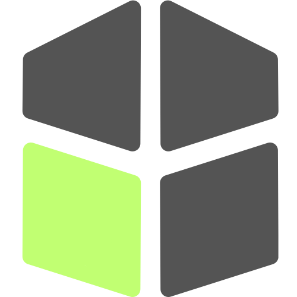

<h1 align="center" style="color: #c1ff72;">Credibal</h1>

<div align="center">
  
</div> 

Credibal is a search engine focused on clarity, credibility, and transparency. Instead of optimizing for popularity or SEO, this project helps users understand **why** a result appears, **what type** of source it is, and **how reliable** the information may be.

> AI is used only to analyze and annotate results - not to replace them.

---

## Problem Statement

Modern search engines are powerful but opaque:

- **Results are ranked with little explanation** - users don't know why certain pages appear first
- **Credibility and evidence quality are unclear** - hard to distinguish reliable sources from unreliable ones
- **Conflicting information is hard to evaluate** - no clear signals when top results disagree

This project aims to make search more **interpretable** and **trust-aware**, without hiding sources behind generated answers.

---

## Core Features

- **Classical keyword-based search** (BM25 / inverted index)
- **Source classification** (academic, government, news, blog, forum)
- **Credibility and evidence indicators** per result
- **Bias / stance signals** shown transparently
- **Conflict detection** when top results disagree
- **"Why this result is ranked here"** explanations
- **Domain- or vertical-focused indexing** (configurable)

---

## What This Is NOT

- A Google/Bing wrapper
- A chat-based search bot
- A an answer-generation engine
- A SEO-driven ranking

**Search results always link back to original sources.**

---

## High-Level Architecture

```
┌─────────────┐
│   Crawler   │  Collects documents from selected domains
└──────┬──────┘
       │
       ▼
┌─────────────┐
│   Indexer   │  Builds a classical inverted index
└──────┬──────┘
       │
       ▼
┌─────────────┐
│Query Engine │  Retrieves and ranks relevant documents
└──────┬──────┘
       │
       ▼
┌─────────────┐
│Analysis Layer│  Adds metadata: source type, bias indicators, evidence density
│ (AI-assisted)│  (AI is used strictly for post-retrieval analysis, not ranking)
└──────┬──────┘
       │
       ▼
┌─────────────┐
│  API & UI   │  Exposes results with clear explanations and filters
└─────────────┘
```

---

## Tech Stack (Tentative)

| Component | Technology |
|-----------|-----------|
| **Backend** | Express/Node.js |
| **Indexing** | Custom inverted index (BM25) |
| **Storage** | PostgreSQL + object storage |
| **AI** | Lightweight classifiers for annotation |
| **Frontend** | Minimal web UI |
| **Deployment** | Cloud-based, containerized |

---

## Project Status

**This is my personal project which is under the planning stage as of February 1, 2026**